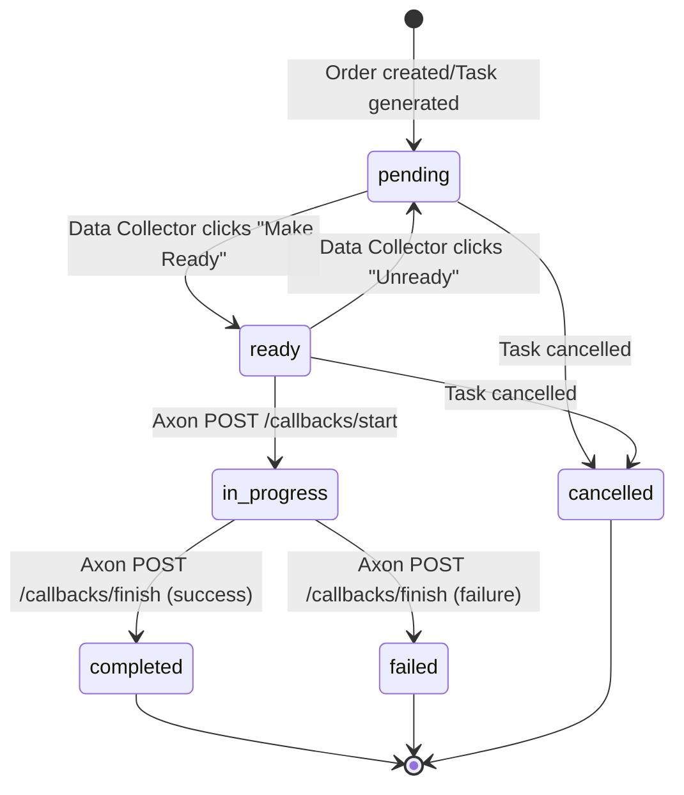

# Task Management Design Document

## 1. Overview

Task is the core entity in the Keystone system, representing a single unit of data collection work. Task connects four key components: production management (Order), edge device (Axon), operator interface (Synapse), and data quality assurance (Dagster QA).

### 1.1 Design Goals

- **State Consistency**: Ensure Task status remains correct in distributed systems
- **Traceability**: Record the complete lifecycle of each Task
- **Crash Recovery**: Support state recovery after edge device failures
- **Performance Optimization**: Support high-concurrency Task queries and status updates

### 1.2 Core Entity Relationships

```
┌─────────────┐     1:N     ┌─────────────┐     0:1     ┌─────────────┐
│    Order    │─────────────│    Task     │─────────────│   Episode   │
│             │  generates  │             │  produces   │             │
│ target_count│             │ status      │             │ qa_status   │
│ scene_id    │             │ scene_id    │             │ qa_score    │
│ sop_id      │             │ workstation │             │ checksum    │
└─────────────┘             └─────────────┘             └─────────────┘
        │               assigned to │
        │                    ┌──────┴───────┐
        │                    │  Workstation │
        │                    │              │
        │                    │ robot_id     │
        └────────────────────│ collector_id │
                             └──────────────┘
```

## 2. Task State Machine

The Task state machine defines the complete lifecycle of a Task, with state transitions following strict rules.

### 2.1 State Definitions

| State | Description | Valid Previous States | Valid Next States |
|-------|-------------|----------------------|-------------------|
| `pending` | Task created, awaiting workstation preparation | `ready`(cancel), `*`(new) | `ready`, `cancelled` |
| `ready` | Data collector clicked "Make Ready", awaiting recording start | `pending` | `in_progress`, `pending`, `cancelled` |
| `in_progress` | Recording in progress | `ready` | `completed`, `failed` |
| `completed` | Recording completed successfully | `in_progress` | *(terminal)* |
| `failed` | Recording failed | `in_progress` | *(terminal)* |
| `cancelled` | Task cancelled | `pending`, `ready` | *(terminal)* |

### 2.2 State Transition Diagram



### 2.3 State Transition Rules

#### pending → ready

- **Trigger**: Data collector clicks "Make Ready" in Synapse UI
- **Validation**:
  - Task status is `pending`
  - Task is assigned to a Workstation
  - Workstation status is `active`
- **Side Effects**:
  - Record `ready_at` timestamp
  - Trigger Axon to pull TaskConfig

#### ready → in_progress

- **Trigger**: Axon calls [`POST /callbacks/start`](implementation/keystone_openapi.md:1083)
- **Validation**:
  - Task status is `ready`
  - `device_id` in callback matches the Workstation's robot
- **Side Effects**:
  - Record `started_at` timestamp
  - Record active ROS Topics

#### in_progress → completed

- **Trigger**: Axon calls [`POST /callbacks/finish`](implementation/axon_teleoperation.md:1107) with `error == null`
- **Validation**: Task status is `in_progress`
- **Side Effects**:
  - Record `completed_at` timestamp
  - Create Episode (`qa_status: pending_qa`)
  - Trigger Edge Dagster QA Job

#### in_progress → failed

- **Trigger**: Axon calls [`POST /callbacks/finish`](implementation/axon_teleoperation.md:1107) with `error != null`
- **Validation**: Task status is `in_progress`
- **Side Effects**:
  - Record `failed_at` timestamp and error message
  - **Do NOT** create Episode

## 3. Task Lifecycle

A complete data collection Task lifecycle consists of 5 phases.

### Phase 0: Order Creation and Task Generation

```
Production Manager → POST /orders → Keystone
                      ↓
                  Order Created
                      ↓
            Keystone auto-generates N Tasks
                      ↓
            Tasks assigned to Workstations (status: pending)
```

- **Task Generation Rules**:
  - Task count = Order's `target_count`
  - Each Task assigned to a Workstation
  - Task inherits Order's `scene_id`, `subscene_id`, `sop_id`

### Phase 1: Task Preparation and TaskConfig Distribution

```
Data Collector → Synapse UI clicks "Make Ready"
                       ↓
            Synapse → PATCH /tasks/{id} {status: "ready"}
                       ↓
            Keystone → Task: pending → ready
                       ↓
            Trigger notification for Axon to pull config
                       ↓
            Axon → GET /tasks/{id}/config (Device token)
                       ↓
            Axon caches TaskConfig, state machine: IDLE → READY
```

**TaskConfig Structure**:

| Field | Type | Description |
|-------|------|-------------|
| `task_id` | string | Unique task identifier |
| `device_id` | string | Robot device ID |
| `scene` | string | Scene name |
| `subscene` | string | Subscene name |
| `skills` | array | Skills list |
| `sop_id` | string | Standard Operating Procedure ID |
| `topics` | array | ROS Topics list |
| `callback_urls` | object | start/finish callback URLs |
| `initial_scene_layout` | object | Initial scene layout |

### Phase 2: Recording Start Callback

```
Operator → Axon triggers recording
           ↓
      Axon state machine: READY → RECORDING
           ↓
      Axon → POST /callbacks/start
           ↓
      Keystone validates device_id
           ↓
      Task: ready → in_progress
```

### Phase 3: Recording Data Flow (Inside Axon)

```
ROS DDS Topics
     ↓
Zero-copy callback
     ↓
SPSC Queue (one per Topic)
     ↓
Worker Thread
     ↓
McapWriterWrapper
     ↓
MCAP File
```

- [`MetadataInjector`](implementation/axon_teleoperation.md:734) embeds `task_id`, `scene`, `subscene`, `skills` into MCAP metadata

### Phase 4: Recording Finish Callback

```
Axon → State machine RECORDING → IDLE
     ↓
Generate sidecar JSON (with SHA-256)
     ↓
Axon → POST /callbacks/finish
     ↓
Keystone triggers subsequent upload process
```

### Phase 5: Episode QA (Dagster involved, Axon not involved)

```
Edge Dagster detects sidecar JSON exists
     ↓
Episode: pending_qa → qa_running
     ↓
Four weighted checks:
  - has_required_topics (30%)
  - duration_within_range (20%)
  - no_large_gaps (20%)
  - images_valid (30%)
     ↓
┌─────────────────────────────────────┐
│ Score ≥ 0.90                        │
│   Episode: → approved               │
│   Trigger Edge-to-Cloud Sync        │
├─────────────────────────────────────┤
│ Score < 0.90                        │
│   Episode: → needs_inspection       │
│   Notify Inspector for manual review│
└─────────────────────────────────────┘
```

## 4. API Interface Design

### 4.1 Task Management Interfaces

| Method | Path | Description | Trigger |
|--------|------|-------------|---------|
| `GET` | `/tasks` | List tasks (with filtering) | Synapse UI |
| `GET` | `/tasks/{id}` | Get task details | Synapse UI |
| `GET` | `/tasks/{id}/config` | Get task config (Axon pull) | Axon |
| `PATCH` | `/tasks/{id}` | Update task status | Synapse UI |
| `POST` | `/tasks` | Create task (internal use) | Order Manager |

### 4.2 Callback Interfaces

| Method | Path | Description | Trigger |
|--------|------|-------------|---------|
| `POST` | `/callbacks/start` | Recording start callback | Axon |
| `POST` | `/callbacks/finish` | Recording finish callback | Axon |

### 4.3 Interface Specifications

#### GET /tasks/{id}/config

```yaml
Request Header:
  Authorization: Device-Token <device_token>

Response 200:
  {
    "task_id": "task_20241220_143052",
    "device_id": "robot_arm_001",
    "scene": "commercial_kitchen",
    "subscene": "station_a",
    "skills": ["pick", "place", "grasp"],
    "sop_id": "sop_001",
    "topics": ["/camera/rgb", "/joint_states", "/tf"],
    "callback_urls": {
      "start": "https://keystone/api/v1/callbacks/start",
      "finish": "https://keystone/api/v1/callbacks/finish"
    }
  }

Response 404: Task not found
Response 409: Task not in 'ready' state
```

#### POST /callbacks/start

```yaml
Request Body:
  {
    "task_id": "task_20241220_143052",
    "device_id": "robot_arm_001",
    "started_at": "2024-12-20T14:30:52Z",
    "topics": ["/camera/rgb", "/joint_states"]
  }

Response 200:
  {
    "status": "acknowledged",
    "task_status": "in_progress",
    "acknowledged_at": "2024-12-20T14:30:53Z"
  }

Response 409: Task not in 'ready' state
```

#### POST /callbacks/finish

```yaml
Request Body:
  {
    "task_id": "task_20241220_143052",
    "status": "finished",
    "duration_sec": 120,
    "message_count": 50000,
    "file_size_bytes": 1073741824,
    "output_path": "s3://archebase-raw-data/...",
    "sidecar_path": "s3://archebase-raw-data/...",
    "checksum": "sha256:...",
    "error": null  // null on success
  }

Response 200 (success):
  {
    "status": "success",
    "task_status": "completed",
    "episode_id": "ep_001"
  }

Response 200 (failure):
  {
    "status": "failed",
    "task_status": "failed",
    "error_recorded": true
  }
```

## 5. Integration with Other Systems

### 5.1 Task and Axon Interaction

**Config Distribution Mode**: Pull instead of push

- When Task status becomes `ready`, Keystone does not push config to Axon
- Axon uses Device token to call `GET /tasks/{id}/config` to actively pull
- This design simplifies Keystone's push logic, relying on Axon's polling mechanism

**Crash Recovery**:

- After Axon restarts, it detects locally cached TaskConfig, state machine recovers to `READY`
- Axon can re-send `POST /callbacks/start` (Keystone needs to handle idempotency)

### 5.2 Task and Synapse UI Interaction

**Status Display**:

- Data collectors see their assigned task queue in Synapse UI
- Real-time status updates via WebSocket or polling

**Operations**:

- "Make Ready": `pending` → `ready`
- "Unready": `ready` → `pending` (timeout or reset)

### 5.3 Task and Dagster QA Interaction

- After Task completes (`completed`), Episode is automatically created
- Episode's `qa_status = pending_qa` triggers Edge Dagster's S3 Sensor
- Dagster detects sidecar JSON and starts QA Job

## 6. Design Key Points

### 6.1 Key Design Decisions

1. **Config distribution uses pull mode**
   - Axon actively calls `GET /tasks/{id}/config` to pull config
   - Simplifies Keystone's push logic, improves system stability

2. **Uses optimistic locking to prevent state conflicts**
   - Task table contains `version` field
   - Check version number during status updates to avoid concurrent conflicts

3. **Crash recovery support**
   - SQLite WAL mode persists upload state
   - MCAP uploads first, JSON uploads last (JSON existence is QA trigger signal)

### 6.2 Invariant Constraints

1. A Task in `pending` state must have an assigned Workstation
2. A Task in `in_progress` state must have a `started_at` timestamp
3. A Task in `completed` state must have exactly one Episode
4. A Task in `failed` state must NOT have an Episode

### 6.3 Performance Considerations

- Use composite index `idx_workstation_status` to accelerate workstation task queue queries
- Denormalize key fields (e.g., `scene_name`) in Task table to avoid frequent JOINs
- Support date-based partitioned queries for Dagster's incremental processing

## 7. Database Schema

### 7.1 tasks table

```sql
CREATE TABLE tasks (
    id BIGINT AUTO_INCREMENT PRIMARY KEY,
    task_id VARCHAR(100) NOT NULL UNIQUE COMMENT 'Human-readable task ID',
    
    -- Relationships
    order_id BIGINT NOT NULL COMMENT 'Parent order',
    batch_id BIGINT COMMENT 'Parent batch',
    workstation_id BIGINT NOT NULL COMMENT 'Assigned workstation',
    scene_id BIGINT NOT NULL,
    subscene_id BIGINT,
    sop_id BIGINT NOT NULL,
    
    -- Status
    status VARCHAR(32) NOT NULL DEFAULT 'pending' COMMENT 'pending|ready|in_progress|completed|failed|cancelled',
    
    -- Timestamps
    created_at TIMESTAMP NOT NULL DEFAULT CURRENT_TIMESTAMP,
    updated_at TIMESTAMP NOT NULL DEFAULT CURRENT_TIMESTAMP ON UPDATE CURRENT_TIMESTAMP,
    ready_at TIMESTAMP COMMENT 'Time when task became ready',
    started_at TIMESTAMP COMMENT 'Time when recording started',
    completed_at TIMESTAMP COMMENT 'Completion time',
    
    -- Runtime data
    attempt_count INT NOT NULL DEFAULT 0 COMMENT 'Attempt count',
    device_id VARCHAR(100) COMMENT 'Recording device ID',
    error_message TEXT COMMENT 'Error message on failure',
    
    -- Metadata
    version INT NOT NULL DEFAULT 0 COMMENT 'Optimistic locking version',
    
    INDEX idx_task_id (task_id),
    INDEX idx_status (status),
    INDEX idx_workstation (workstation_id),
    INDEX idx_order (order_id),
    INDEX idx_batch (batch_id),
    INDEX idx_created (created_at),
    INDEX idx_completed_at (completed_at),
    INDEX idx_workstation_status (workstation_id, status, created_at)
) ENGINE=InnoDB DEFAULT CHARSET=utf8mb4;
```

### 7.2 Index Optimization

| Query Scenario | SQL Example | Index |
|----------------|-------------|-------|
| Get workstation pending tasks | `SELECT * FROM tasks WHERE workstation_id = ? AND status = 'pending'` | `idx_workstation_status` |
| Filter tasks by factory | `SELECT * FROM tasks WHERE factory_id = ?` | `idx_factory` |
| Date-based partitioned query | `SELECT * FROM tasks WHERE created_at >= ?` | `idx_created` |
| Count completed tasks | `SELECT COUNT(*) FROM tasks WHERE order_id = ? AND status = 'completed'` | `idx_order_status` |

## 8. Reference Documents

- [Keystone OpenAPI](implementation/keystone_openapi.md)
- [Keystone Schemas](implementation/keystone_schemas.md)
- [Keystone Database](implementation/keystone_database.md)
- [Synapse State Machines](implementation/synapse_state_machines.md)
- [Axon Teleoperation](implementation/axon_teleoperation.md)
- [Edge Management](implementation/synapse_edge_management.md)
